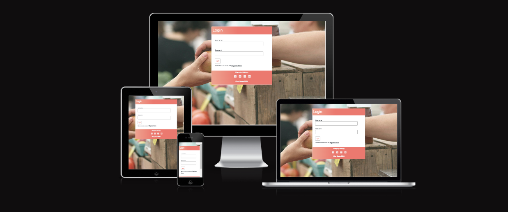
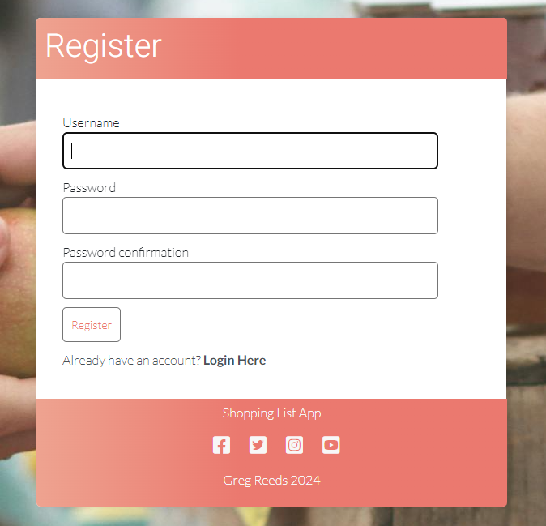
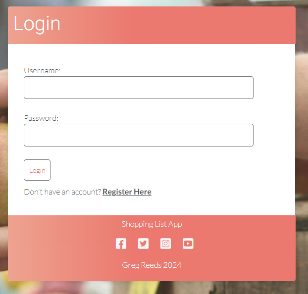
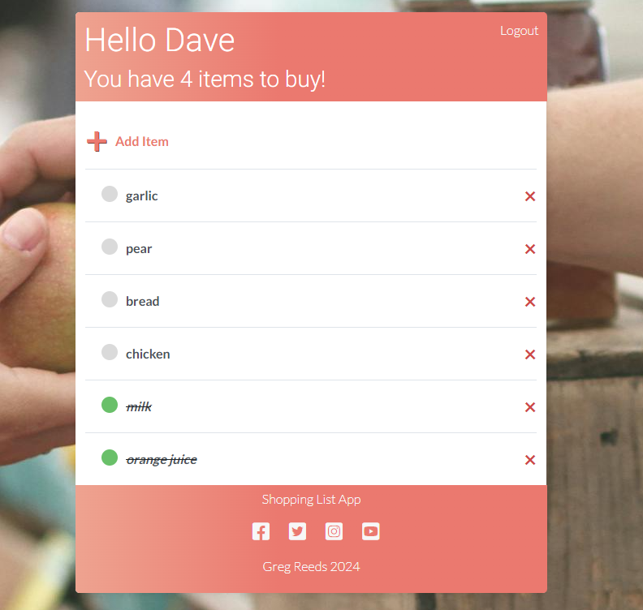

# Shopping List App

[-> Link to live site here <-](https://shopping-list-app-bd52d42b5faa.herokuapp.com/)

Shopping List App is a simple lightweight application which allows users to create a shopping list. This will help the user to note down items as they realise they need them, and not forget them when they are in the supermarket.

The app is built mainly utilising Django Python web framework and primarily makes use of CRUD (create, read, update & delete) functions.

The user is able to add items to a list, edit these items by changing their name or marking as complete (bought), and delete items off the list. Users must register an account to use the app and can access their list if logged in. Each user can only see their own lists and entered items. The data is stored on a cloud database meaning that a user can log in anywhere and on any device. A one-to-many relationship is adopted on this project for simplicity.

[-> Link to live site here <-](https://shopping-list-app-bd52d42b5faa.herokuapp.com/)

## Features

### Existing Features

- __Register__

    - The register view allows the user to create an account.
    - The user inputs a chosen username and password which they must enter twice to avoid a mistake in the password.
    - This information is stored on the database with the password being encripted.

- __Login__

    - The login view acts as the landing page for the app if not already logged in.
    - If already registered, a user can enter their username and password to take them to their personalised list view page.

- __List__

    - The list page is the main view of the app.
    - The user can only see if if logged in.
    - The header on the list page states "Hello -Username-" with the first letter of the name always being capitalized by the {{request.user|title}} function.
    - The header also says how many items the user has left to buy. The word items utilizes a pluralize function in order to remove the 's' to say item when the number is 1.
    - At the top right of the page there is a 'Logout' button. This will log out the user and direct them back to the login page.

