# Shopping List App

[-> Link to live site here <-](https://shopping-list-app-bd52d42b5faa.herokuapp.com/)

Shopping List App is a simple lightweight application which allows users to create a shopping list. This will help the user to note down items as they realise they need them, and not forget them when they are in the supermarket.

The app is built mainly utilising Django Python web framework and primarily makes use of CRUD (create, read, update & delete) functions.

The user is able to add items to a list, edit these items by changing their name or marking as complete (bought), and delete items off the list. Users must register an account to use the app and can access their list if logged in. Each user can only see their own lists and entered items. The data is stored on a cloud database meaning that a user can log in anywhere and on any device. A one-to-many relationship is adopted on this project for simplicity.

[-> Link to live site here <-](https://shopping-list-app-bd52d42b5faa.herokuapp.com/)

## User Stories

In the development of this project, an agile approach was utilised. This helped initially to break down the project into more manageable chunks by mapping out steps to achieve the final goal. User stories are a big part of the agile approach and help to specify goals based on the user/client requests. 

I used github boards for my user stories. It allows you to input user stories as an 'issue' into a to-do list. They were then moved to in progress as the acceptance criteria were worked on. Once the acceptance criteria were met, the user story is complete and moved to the 'done' column of the board. When working in a team it is a great way of keeping track of who is doing what, espically as you can comment on the issues.

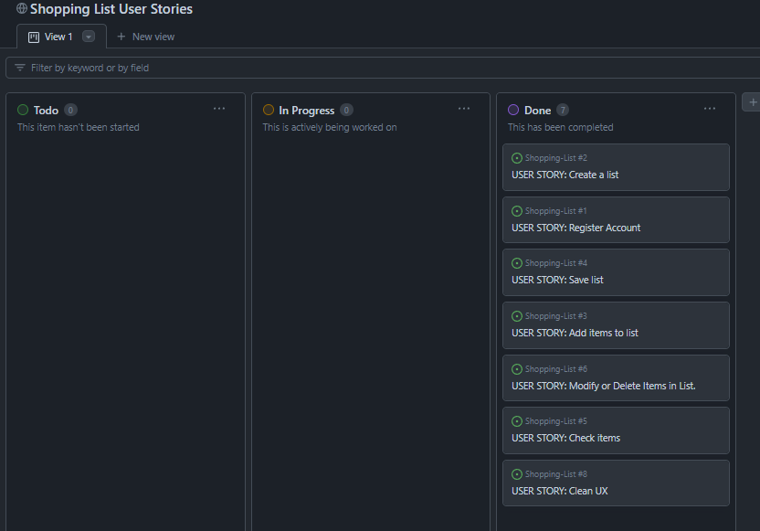

Here are the user stories for this project:

- Register Account - As a site user I can register an account so that I am able to see personally created lists.
    - Acceptance criteria 1 - User able to register account using username(maybe email) and password.
    - Acceptance criteria 2 - User able to login/logout securely using these credentials.

- Create a list – As a user I am able to create a shopping list that is my own.
    - Acceptance criteria 1 - User not able to see other user's items.
    - Acceptance criteria 2 - Lists created by user are only viewable by that specific user.

- Add items to list – As a user I am able to add custom items to my shopping list.
    - Acceptance criteria 1 - Able to add custom items to a list.
    - Acceptance criteria 2 - The item must be simple to input.

- Save list – As a user I am able to view a created list at a later date.
    - Acceptance criteria 1 - The list is saved to the database so that the user is able to view again at a later date.
    - Acceptance criteria 2 - The saved list is accessible when the user logs back on.

- Check items – As a user I am able to click on an item on the list in order to show that it is obtained. This will be shown clearly with strikethrough text.
    - Acceptance criteria 1 - Clicking/tapping on item in list checks it off list.
    - Acceptance criteria 2 - Item shows with strikethrough text and different colour to make it obviously checked.

- Modify or delete items in list – As a user I am able to modify or delete items on my list.
    - Acceptance criteria 1 - User able to delete items off list by clicking a button.
    - Acceptance criteria 2 - User able to modify text of item by clicking a button.

- Clean UX – As a user I expect a straight forward user interface so that I have a good experience while using the app.
    - Acceptance criteria 1 – Interface easy to navigate.
    - Acceptance criteria 2 – No clashing colors so that text is easy to read.
    - Acceptance criteria 3 – Responsive to different devices and screen sizes.

## Features

### Existing Features

__Register__

- The register view allows the user to create an account.
- The user inputs a chosen username and password which they must enter twice to avoid a mistake in the password.
- This information is stored on the database with the password being encripted.

__Login__

- The login view acts as the landing page for the app if not already logged in.
- If already registered, a user can enter their username and password to take them to their personalised list view page.

__List__

- The list page is the main view of the app.
- The user can only see it if logged in.
- The header on the list page states "Hello -Username-" with the first letter of the name always being capitalized by the {{request.user|title}} function.
- The header also says how many items the user has left to buy. The word 'items' utilizes a pluralize function in order to remove the 's' to say 'item' when the number is 1.
- At the top right of the page there is a 'Logout' button. This will log out the user and direct them back to the login page.

- The main area of the list view is populated by the list itself.
- The add item button takes the user to the create list view where they can create a list item.
- When an item is added, it is listed with a grey circle next to it. This shows that it has not yet been obtained.
- When an item is clicked the user is taken to the edit view where they can rename it or mark as complete(checked).
- When an item is marked as complete, the grey circle becomes green and the text becomes italic and strikethrough. The item also then goes to the bottom of the list. This makes it extremely clear that the item has been marked as complete.
- The last function on the list view is the ability to delete. This opens the delete view prompting the user to confirm deletion.
- When no items are in the list, the view shows a no items in list message. This may be because the user is now, or the user has deleted all items from the list. This goes away as soon as an item is added.

    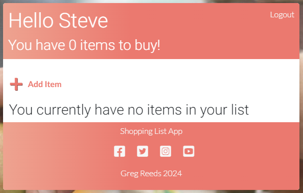

 __Add Item__
 - When a user clicks on the "Add Item" button, they are taken to the add item view.
 - The user names the item and presses submit. This posts a list item to the server and lists it on the list view as incomplete(grey circle).
 - As soon as sumbit is clicked, the user is taken back to the list view via "reverse_lazy('lists')".
 - If the user does not want to add an item at this point, they can bress the "Go Back" button on the top left of the header.

    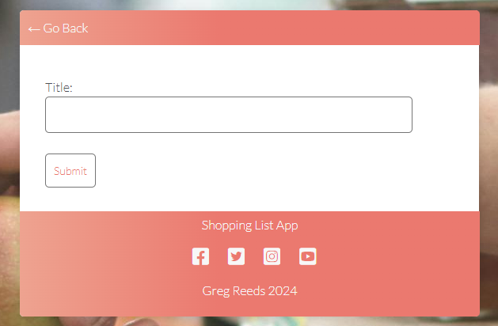

__Edit Item__
- The edit item view is very similar to the the add item view. It however includes the complete checkbox as well as the name of the item in 'Title'.
- The user can edit the name of the item here and submit to save the changes.
- If the complete box is checked and submitted, the named item on the list moves to the bottom, has strikethrough,italic and a green circle to show that it is complete.
- Both "Go Back" and "Submit" will take the user back to the main list view.

    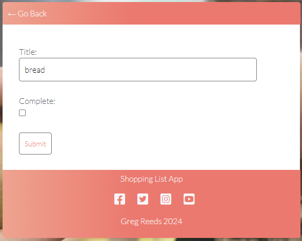

__Delete Item__
- When a red X associated with the item on that line is clicked, the user is taken to an alert page with a prompt asking to confirm deletion of the item.
- The user can press "Delete" to confirm deletion of the item. This also removes it from the database.
- If the user does not want to delete, they can click the "Go Back" button in the header.

    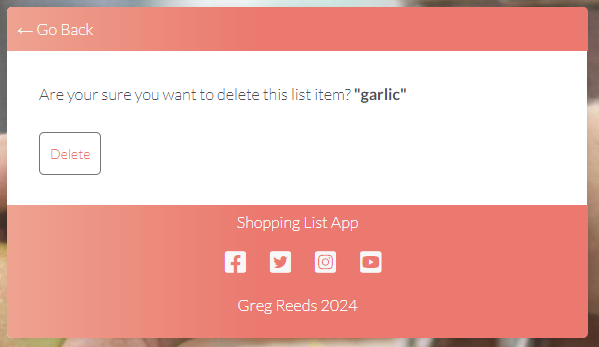

### Future Features
- Add function to clicking on item automatically marks it to complete and edit view as separate button next to delete on the list line.
- Ability to create multiple saved and custom titled lists for each individual user. This would need to be done with extra models and views.
- Ability to share lists with other users if desired.
- Add favourite items function so that user can add them to list without having to type fully.

## Development

__Models__

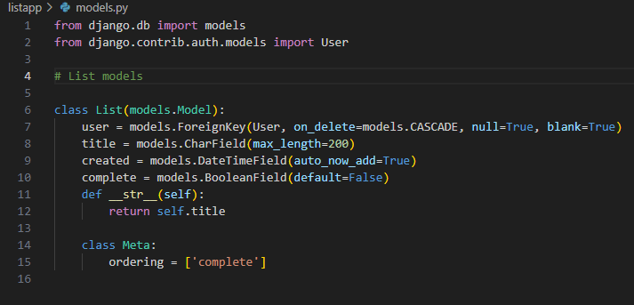

The models used were:
- user - Using ForeignKey to identify unique registered users. The model includes a cascade on delete in order to remove all their posted data if the account is deleted.
- title - This sets the model for list items.
- created - Shows date and time of a post. This would be useful for the future when multiple lists are made for UX as well as ordering. Currently this is useful for seeing posts in the database.
- complete - The model which deals with marking and modifying an item as completed or not.
- The Meta for ordering is the initial means of ordering the list and putting completed items at the end.

__A little behind the scenes of the app before styling:__

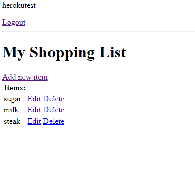

__Technologies Used__

- Python - an interpreted, object-oriented, high-level programming language https://www.python.org/.
- Django - Framework facilitating building full stack web application https://www.djangoproject.com/.
- Javascript - High-level programming language https://www.javascript.com/.
- HTML5 - Markup language used to make webpages https://html.com/html5/.
- CSS3 - A language used to style HTML and XHTML documents presentations in web development.
- Gitpod - Online integrated development environment https://www.gitpod.io/.
- GitHub - Version control service used for storing and sharing development projects https://github.com/.
- Heroku - a container-based cloud platform where developers can deploy their projects https://www.heroku.com/.
- ElephantSQL - The SQL cloud database used for all user data and items https://www.elephantsql.com
    - Screenshot example from my database on Elephant:
    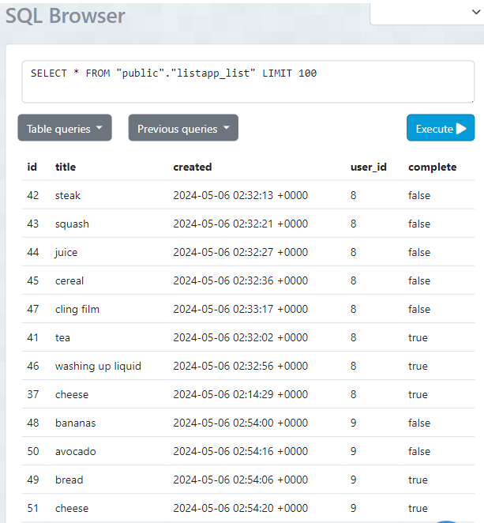

## Bugs and Testing

__Bugs__

When deploying to Heroku, it was discovered that no custom css styling was being applied to the app.
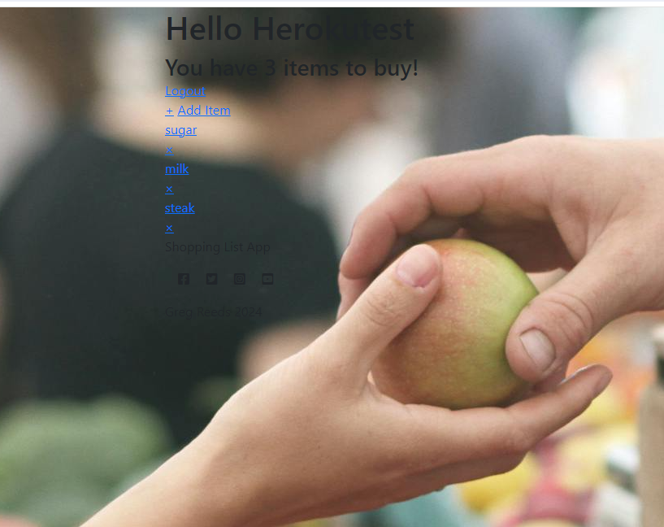

It was discovered that I had not performed a 'collectstatic' so none of my static files were connecting to the dijango app when debug was set to False. I performed the collectstatic and redeployed. All was fine.
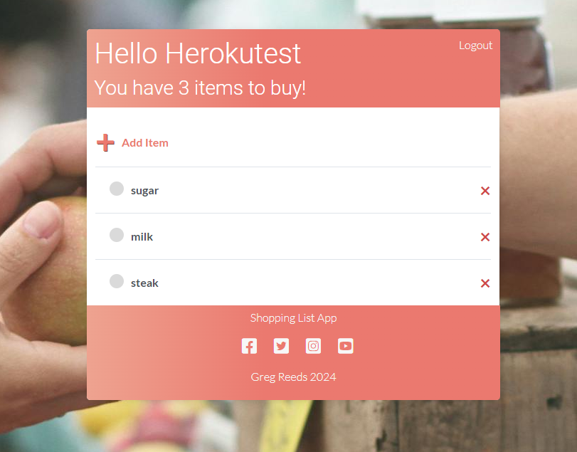

Earlier in development, the project would not deploy at all on Heroku. It was discovered after much time that python had a capital P in the runtime.txt file. Heroko therefore did not know what version of python to load and ceased the build. These two deployment issues were a good learning curve.

__Testing__

All HTML documents were parsed through the w3 Nu Html checker.

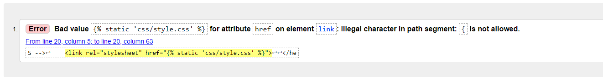
This is the main.html (base). It seems that is an unavoidable issue when working with django as these syntaxes are important. I am yet to find a workaroud/fix. It is a common 'issue' thorught all of the html decuments. Here is the login page for example:
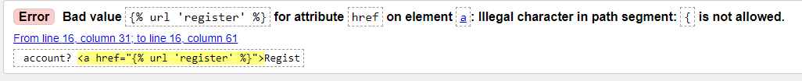

I passed the python code through the Code Institute PEP8 Python Linter. Here is the models:
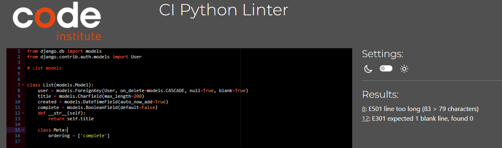
And here is the Views:
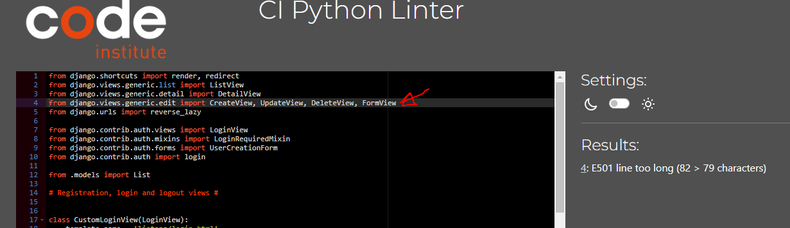

It seems here that again these are unavoidable dijango syntaxes, mainly being too long on one line.

I passed the style.css through the W3C CSS Validator:
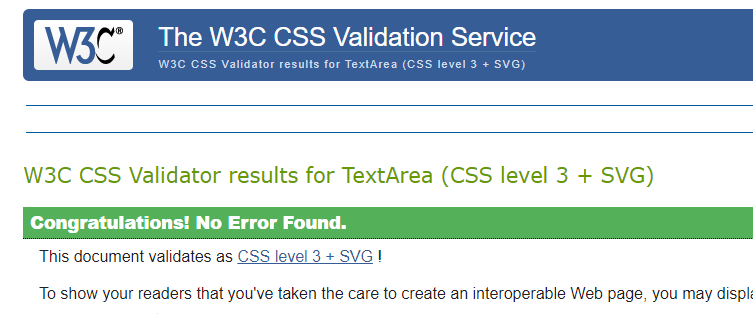
All great!

I was not able to validate any javascript as none was used by me in this project in the end.

I performed a lighthouse test on the deployed app and all seemed good:
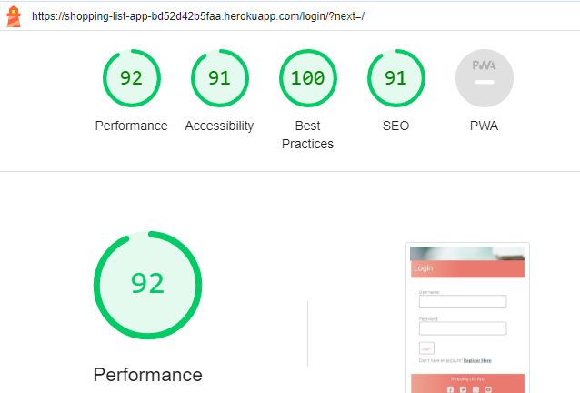
I did the same on the other pages in the app and results were all similar.

__Manual Testing__

- Many users were created and the app funcioned as it should on all of them. Many combinations of list items were used and all stayed private to each user.
- All registration attempts worked as expected.
- All logins and logouts functioned as expected.
- All list midifications functioned as expected.
- All deletions worked well and were removed from the database.
- Deletion of users collaped deletion of all data also worked.
- The app was tested on multiple operating systems including Chrome, Microsoft Edge, Firefox, Opera and Safari. The app functioned identically on all.
- The app was tested on multiple tablets and mobile devices. The only slight issue I have come accross is the header does not size correctly. This is mainly on smaller screens/devices. I believe this to be a clash with a boostrap model as the best I could do was resize and ofset it on larger screens to make it look correct. This was done in custom style.css. It is meant to be the same width as the container at any screen size. With the nature of the app, there was no real need for media queries. Where this could fix the header issue, it may be worht testing without bootstrap installed first.
- The error in the terminal warning about no favicon was constant so I added a relevant favicon.

## Deployment
This project uses [Heroku](https://www.heroku.com), a platform as a service (PaaS) that enables developers to build, run, and operate applications entirely in the cloud.

Deployment steps are as follows, after account setup:

- Select *New* in the top-right corner of your Heroku Dashboard, and select *Create new app* from the dropdown menu.
- Your app name must be unique, and then choose a region closest to you (EU or USA), and finally, select *Create App*.
- From the new app *Settings*, click *Reveal Config Vars*, and set the following key/value pairs:
  - `CLOUDINARY_URL` (insert your own Cloudinary API key here)
  - `DATABASE_URL` (this comes from the **Resources** tab, you can get your own Postgres Database using the Free Hobby Tier)
  - `SECRET_KEY` (this can be any random secret key)
  - `PORT` (8000)

Heroku needs two additional files in order to deploy properly.
- requirements.txt
- Procfile

You can install this project's requirements (where applicable) using: `pip3 install -r requirements.txt`.
If you have your own packages that have been installed, then the requirements file needs updated using: `pip3 freeze --local > requirements.txt`

The Procfile can be created with the following command: `echo web: gunicorn shoppinglist.wsgi > Procfile`

For Heroku deployment, follow these steps to connect your GitHub repository to the newly created app:

Either:
- Select "Automatic Deployment" from the Heroku app.

Or:
- In the Terminal/CLI, connect to Heroku using this command: `heroku login -i`
- Set the remote for Heroku: `heroku git:remote -a <app_name>` (replace app_name with your app, without the angle-brackets)
- After performing the standard Git `add`, `commit`, and `push` to GitHub, you can now type: `git push heroku main`

The frontend terminal should now be connected and deployed to Heroku.
## Credits

- Code Institute - for the mock deployment terminal
- Code Institute - for teaching the basics of django via the Codestar walkthrough Project. It helped a lot!
- Stack overflow - for information to help linking models to view for user items.
- W3Schools - Information on how the reverse_lazy function works.
- Dennis Ivanov - Lessons on Django class based views and how to utilize them for this project

- Background image courtesey of Pexels.com

Thank you for spending time viewing my project.

